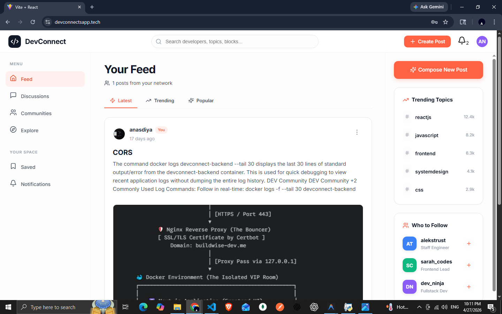

<div align="center">

# DevConnect

**A production-grade developer community platform — built, containerized, and deployed to AWS.**

[](https://devconnectsapp.tech)
[](https://nodejs.org)
[](https://docker.com)
[](https://aws.amazon.com)

</div>

---



---

## What It Does

DevConnect is a community platform for developers to share articles, ask questions, and connect with peers — inspired by dev.to.

The focus wasn't just building features. It was building them **the right way** — clean separation of concerns, real AWS infrastructure, S3 image uploads, and a containerized deployment pipeline.

---

## Architecture

```
Client (React)
     │
     ▼
Express REST API  ──►  MongoDB Atlas
     │
     ├──► AWS S3          (image storage — Sharp optimization)
     └──► AWS EC2 + Nginx (production deployment)
```

**Request flow:** React → Nginx → Express routes → Controller → MongoDB / S3 → Response

The server is split into `app.js` (Express config, middleware, routes) and `server.js` (HTTP listener) — enabling clean unit testing without starting the full server.

---

## Tech Stack

| Layer | Technology |
|---|---|
| Frontend | React, Redux Toolkit, Axios |
| Backend | Node.js, Express.js |
| Database | MongoDB Atlas (Mongoose ODM) |
| Auth | JWT (access + refresh token pattern) |
| File Storage | AWS S3 (IAM role, Sharp optimization) |
| Containerization | Docker, Docker Compose |
| Reverse Proxy | Nginx (EC2, SSL termination) |
| Deployment | AWS EC2 (ap-south-1, Mumbai) |
| CI/CD | GitHub Actions |

---

## Key Technical Decisions

**AWS S3 for image storage** — images are processed with Sharp (resize + compress) before upload, then sent to S3. EC2 storage stays clean and uploads are non-blocking. Uses IAM role on EC2 — no hardcoded credentials.

**JWT with refresh tokens** — access tokens are short-lived (15min); refresh tokens are stored in `httpOnly` cookies, inaccessible to JavaScript. Silent refresh via Axios interceptors — users never get logged out unexpectedly.

**app.js / server.js separation** — Express app config is decoupled from the HTTP server. The app can be imported and tested in isolation without binding to a port.

**Docker Compose for local parity** — the same `docker-compose.yml` used locally mirrors the production setup, eliminating environment-specific bugs.

---

## Local Setup

### Prerequisites
- Node.js 18+
- Docker + Docker Compose
- MongoDB connection string (Atlas or local)
- AWS account (S3 bucket + IAM user with `s3:PutObject` permission)

### Run with Docker

```bash
git clone https://github.com/anas-muhmed/DevConnect.git
cd DevConnect
cp backend/.env.example backend/.env   # fill in your credentials
docker-compose up --build
```

App runs at `http://localhost:8080`

### Run without Docker

```bash
# Backend
cd backend && npm install
npm run dev          # runs on port 5000

# Frontend (separate terminal)
cd frontend && npm install
npm run dev          # runs on port 5180
```

### Environment Variables

Create `backend/.env` (copy from `backend/.env.example`):

```env
PORT=5000
MONGO_URI=your_mongodb_connection_string
JWT_SECRET=your_jwt_secret
JWT_REFRESH_SECRET=your_refresh_secret
AWS_REGION=ap-south-1
AWS_S3_BUCKET=your_bucket_name
# AWS credentials — use IAM role on EC2, keys only for local dev
AWS_ACCESS_KEY_ID=your_access_key
AWS_SECRET_ACCESS_KEY=your_secret_key
```

> ⚠️ Never commit `.env`. Use `.env.example` as the template.

---

## Project Structure

```
DevConnect/
├── frontend/                # React frontend
│   └── src/
│       ├── components/
│       ├── pages/
│       ├── redux/           # Redux Toolkit (authSlice, profileSlice)
│       └── api/             # Axios instance + API helpers
├── backend/
│   ├── app.js               # Express config, middleware, routes
│   ├── server.js            # HTTP server entry point
│   ├── controllers/         # Request handlers + business logic
│   ├── models/              # Mongoose schemas
│   ├── middleware/          # Auth, upload, image optimization, validation
│   └── routes/
├── .github/workflows/       # GitHub Actions CI/CD
├── docker-compose.yml
└── backend/.env.example
```

---

## CI/CD Pipeline

GitHub Actions workflow on every push to `main`:

```
Code push → Run tests → Docker build → Push to AWS ECR → SSH into EC2 → Pull & restart containers
```

Pipeline defined in `.github/workflows/deploy.yml`.

---

## Live Demo

🌐 **[Visit DevConnect →](https://devconnectsapp.tech)**

---

<div align="center">

Built by [Anas](https://github.com/anas-muhmed) · [LinkedIn](https://www.linkedin.com/in/anas-muhmed)

</div>
